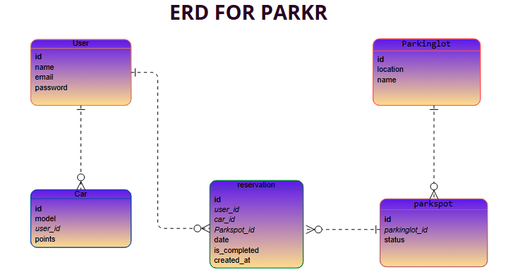

# 🚗 PARKR Backend
Smart Parking Management System Backend (Django REST Framework)

---

## 🔹 Project Overview
The **PARKR Backend** is the server-side API for the Parkr system — a smart parking web application that allows users to view, reserve, and manage parking spots in real-time.  
It provides a RESTful API for user authentication, parking lot management, reservations, and car tracking.

**Main Goals:**
- Allow users to find and reserve available parking spots
- Manage cars and reservations per user
- Track parking lot and spot status dynamically
- Award user points for activity and reports

---


### Repository Descriptions

**Backend Repository (Current):**
- Django REST API backend with JWT authentication
- PostgreSQL database integration
- RESTful API endpoints for tickets, work logs, reactions, and user management
- Role-based permissions and authorization
- Docker containerization support

**Frontend Repository:**
- React Single Page Application (SPA)
- Separate dashboards for Staff, Technicians, and Admins
- Modern UI with React Router for navigation
- Vite build tool for fast development and production builds

---

## 🔹 Tech Stack  

### Backend Technologies
- **Framework:** Django
- **API:** Django REST Framework
- **Authentication:** JWT (JSON Web Tokens) using SimpleJWT
- **Database:** PostgreSQL 16
- **Containerization:** Docker, Docker Compose
- **CORS:** django-cors-headers

### Frontend Technologies
- **Framework:** React
- **Router:** React Router
- **Build Tool:** Vite
- **HTTP Client:** Fetch API

### Development & Deployment
- **Containerization:** Docker, Docker Compose
- **Version Control:** Git, GitHub
- **Deployment:** TBD

---


## 🔹 Front End Repository Link  
👉 [Frontend Repository - GitHub](https://github.com/Maalialdh/Parkr_Frontend.git)


---
**Backend Live Site:**  
🔗 [_website url_](http://localhost:8000//)


## 🔹 ERD Diagram


---

## Database Models

1. **User (Django Built-in)**
   - Handles authentication and credentials (username, password, email)

2. **Parkinglot**
   - Fields: `name`, `location`
   - Relationship: One-to-Many with `Parkspot`

3. **Parkspot**
   - Fields: `status`, `parkinglot_id`
   - Status choices: available / reserved / occupied
   - Linked to `Parkinglot`

4. **Car**
   - Fields: `model`, `user`, `points`
   - Linked to User (each user can have multiple cars)

5. **Reservation**
   - Fields: `user`, `car`, `Parkspot`, `date`, `created_at`, `is_completed`
   - Represents a booking of a parking spot by a user’s car

---
## Entity relationships:
- User → Car (1:M)
- User → Reservation (1:M)
- Car → Reservation (1:M)
- Parkinglot → Parkspot (1:M)
- Parkspot → Reservation (1:M)

---

##  Routing Table (API Endpoints)
All endpoints require JWT authentication unless otherwise specified. Include the token in the Authorization header: `Authorization: Bearer <token>`


| Method | Endpoint                       | Description                  | Authentication | Permissions         |
| ------ | ------------------------------ | ---------------------------- | -------------- | ------------------- |
| POST   | `/users/signup/`               | Register a new user          | ❌ No           | Public              |
| POST   | `/users/login/`                | Login and get JWT token      | ❌ No           | Public              |
| GET    | `/parkinglots/`                | Get list of parking lots     | ✅ Yes          | Authenticated users |
| POST   | `/parkinglots/`                | Create a new parking lot     | ✅ Yes          | Admin               |
| GET    | `/parkspots/`                  | Get all parking spots        | ✅ Yes          | Authenticated users |
| POST   | `/parkspots/`                  | Create a new parking spot    | ✅ Yes          | Admin               |
| PUT    | `/parkspots/<id>/`             | Update parking spot status   | ✅ Yes          | Admin               |
| GET    | `/cars/`                       | List all cars                | ✅ Yes          | Authenticated users |
| POST   | `/cars/`                       | Add a new car                | ✅ Yes          | Authenticated users |
| GET    | `/reservations/`               | List all reservations        | ✅ Yes          | Authenticated users |
| POST   | `/reservations/`               | Create a new reservation     | ✅ Yes          | Authenticated users |
| GET    | `/reservations/<id>/`          | Get reservation details      | ✅ Yes          | Authenticated users |
| PUT    | `/reservations/<id>/complete/` | Mark reservation as complete | ✅ Yes          | Authenticated users |
| DELETE | `/reservations/<id>/`          | Cancel reservation           | ✅ Yes          | Owner or Admin      |

### url
- **Local Development:** `http://localhost:8000`
- **Production:** 


---
## 🔹 Installation Instructions (Docker)

### Prerequisites
- Docker 
- Docker Compose 
- Git

---
### 🐍 Backend Setup

1. **Clone the repository:**
   ```bash
   git clone https://github.com/Maalialdh/Parkr_Backend.git
   cd Parkr_backend
   ```

---

2. **Create environment file:**
 ```bash
# .env file
SECRET_KEY=your-secret-key
SQL_ENGINE=django.db.backends.postgresql
SQL_DATABASE=parkr_db
SQL_USER=parkr_user
SQL_PASSWORD=securepassword
SQL_HOST=db
SQL_PORT=5432

 ```
3. **Start the database service:**
   ```bash
   docker compose up -d db
   ```
4. **Build and start the API service:**
   ```bash
   docker compose up -d api
   ```
5. **Run database migrations:**
   ```bash
   docker compose exec api python manage.py migrate
   ```


6. **Create a superuser (admin account):**
   ```bash
   docker compose exec api python manage.py createsuperuser
   ```
7. **Access the API:**
   - API will be available at: `http://localhost:8000`
   - Django Admin panel: `http://localhost:8000/admin`

---


## ⚛️ Frontend Setup

1. **Clone the frontend repository:**
   ```bash
   git clone https://github.com/Maalialdh/Parkr_Frontend.git
   cd Parkr_Frontend
   ```


2. **Create environment file:**
   ```bash
   # Create .env file in the frontend directory
   # Add the following:
   VITE_API_BASE=http://localhost:8000
   ```

3. **Install dependencies:**
   ```bash
   npm install
   ```

4. **Start development server:**
   ```bash
   npm run dev
   ```

5. **Access the frontend:**
   - Frontend will be available at: `http://localhost:5173`

---

## 🧩 Run Everything Together (Optional)

If you want to run both backend and frontend services together:

```bash
# From the root directory (with docker-compose.yml)
docker compose up -d

# View logs
docker compose logs -f api
docker compose logs -f db

# Run migrations if needed
docker compose exec api python manage.py makemigrations
docker compose exec api python manage.py migrate
```
## 🛑 Stopping Services

```bash
# Stop all services
docker compose down

# Stop and remove volumes (⚠️ This will delete database data)
docker compose down -v
```

---
## 🧊 IceBox Features (Future Enhancements)
* 📊 Admin dashboard with real-time analytics
* 🅿️ Smart sensors integration for automatic updates
* 🔔 Notifications for reservation status
* 💰 Payment system integration
* 📱 Mobile app version for users
* 🎁 Advanced reward system with redeemable points
